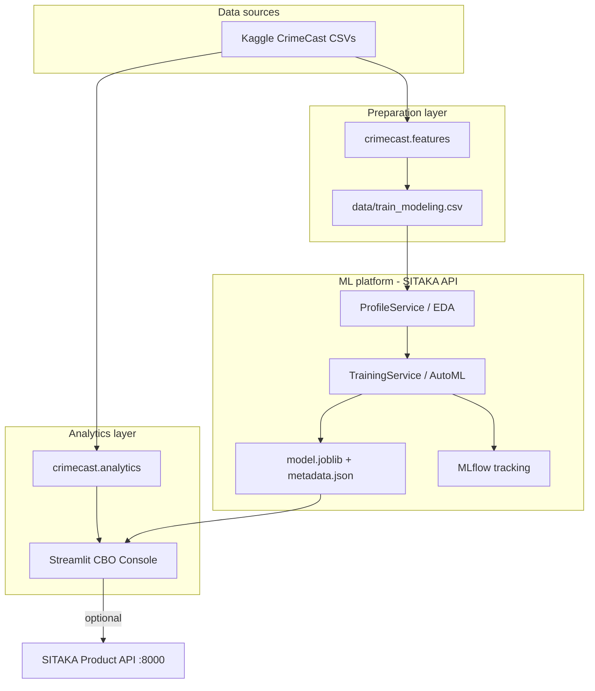

# Architecture

## System context



## Repository layout

| Path | Responsibility |
| --- | --- |
| `app/streamlit_app.py` | Multi-page executive console |
| `src/crimecast/` | Data loading, feature engineering, KPI analytics, SITAKA bridge |
| `config/sitaka.yaml` | AutoML, MLflow, deployment settings |
| `scripts/prepare_data.py` | CLI to build `train_modeling.csv` |
| `data/` | Kaggle downloads (gitignored except `sample.csv`) |
| `sitaka_artifacts/` | EDA reports, metrics, model bundle (generated) |
| `docs/` | CBO, architecture, deployment guides |

## Feature engineering

`build_modeling_frame()` derives:

- Calendar features from `Date_Occurred` / `Date_Reported`
- `occurred_hour` from military-time `Time_Occurred`
- `report_lag_days`, `has_weapon`, `victim_age_missing`

High-cardinality street text and post-incident workflow fields are removed before AutoML.

## SITAKA integration modes

### Local workflow (default)

The Streamlit **Model Lab** imports SITAKA workflow services directly:

- `ProfileService.profile`
- `TrainingService.train`
- `EvaluationService.evaluate`
- `PredictionService.predict`

No API server required—ideal for laptops and air-gapped demos.

### Remote product API

Set environment variables:

```bash
export SITAKA_API_URL=http://ml-platform.bank.internal:8000
export SITAKA_API_KEY=<from-vault>
```

Start server: `sitaka server` ([documentation](https://pypi.org/project/sitaka-api/)).

Use SDK methods (`create_project`, `train_project`, `predict`) from batch jobs or CI pipelines.

## Model artifact contract

SITAKA writes:

```text
sitaka_artifacts/models/best_model/
  model.joblib      # sklearn Pipeline
  metadata.json     # features, metric, task, target
```

The Scenario Simulator supplies a record dict matching `metadata.features`.

## Security & compliance (enterprise)

- Run Streamlit behind SSO reverse proxy (Azure AD, Okta).
- Store `SITAKA_API_KEY` in vault secrets; never commit `.streamlit/secrets.toml`.
- Restrict egress from training hosts; Kaggle download is a one-time bootstrap.
- Register models in internal MRM inventory with lineage from MLflow run IDs.

## Extension points

- Swap `train.csv` for bank-sourced incident feeds with the same target schema.
- Increase `automl.n_trials` in `config/sitaka.yaml` for production-grade search.
- Add `sitaka-api[boosting]` for LightGBM/XGBoost backends when published in your environment.
